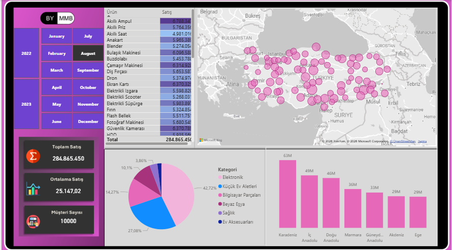
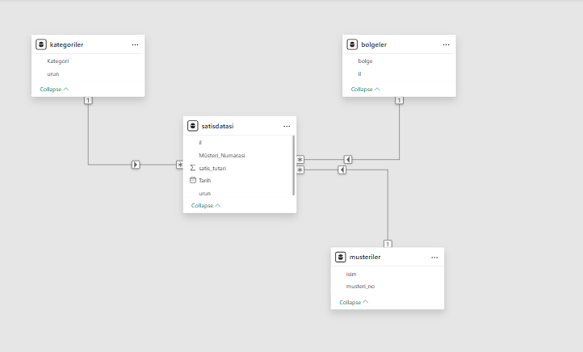

# Power BI Sales Dashboard

## Türkçe / Turkish

### Dashboard

### Data Model

Proje Hakkında

Bu proje, Microsoft Power BI kullanılarak geliştirilmiş etkileşimli bir Satış Analizi Dashboard çalışmasıdır.

Dashboard, 2022–2023 yılları arasındaki satış performansını bölge, kategori ve zaman bazında analiz etmeyi amaçlamaktadır.

**Dashboard Tasarımı:**
- Özel arka plan ve yerleşim PowerPoint ile hazırlandı
- Tutarlı renk paleti ve sol panel tasarımı oluşturuldu
- Görsel hiyerarşi güçlendirildi
- Power BI içerisinde hizalama ve optimizasyon yapıldı

Bu çalışma, veri analizi becerilerinin yanı sıra tasarım ve arayüz farkındalığını da göstermektedir.

Proje Amaçları

Genel satış performansını analiz etmek

Bölgesel satış karşılaştırması yapmak

En yüksek performans gösteren ürün kategorilerini belirlemek

Yıllık ve aylık trendleri incelemek

Filtreleme ile dinamik analiz imkanı sunmak

Veri Seti

Kullanılan veri seti şu alanları içermektedir:

Ürün Adı

Kategori

Satış Tutarı

Bölge

Şehir Bilgisi (Harita için)

Yıl (2022–2023)

Müşteri Sayısı

Dashboard Bileşenleri

1) KPI Kartları

 -Toplam Satış

 -Ortalama Satış

 -Müşteri Sayısı

2) Harita Görselleştirmesi

 -Türkiye genelinde şehir bazlı satış dağılımı

3) Sütun Grafiği

 -Bölgesel satış karşılaştırması

4) Pasta Grafiği

 -Kategori bazlı satış dağılımı

5) Tablo

 -Ürün bazlı satış detayları

 Filtreler (Slicer):

 -Yıl filtresi (2022–2023)

 -Ay filtresi (Ocak–Aralık)

 -Kullanılan Teknolojiler
 
Microsoft Power BI

Veri Modelleme

Etkileşimli görselleştirmeler

Bing Maps entegrasyonu

 Elde Edilen İçgörüler
 
Bazı bölgeler toplam satışta diğerlerinden daha yüksek performans göstermektedir.

Elektronik ve Beyaz Eşya kategorileri satışlarda önemli paya sahiptir.

Satışlar yıllara ve aylara göre değişkenlik göstermektedir.

Harita görselleştirmesi bölgesel yoğunluğu net şekilde ortaya koymaktadır.

Özellikle şu konulara odaklanılmıştır:

KPI oluşturma

Dashboard tasarımı

Veri analizi

Veri hikayeleştirme

Nasıl KUllanılır:
1-Burdan .pbix dosyasını indirin
2-Microsoft Power BI Desktop'ta açın
3-Gerekirse,verileri yeniden bağlayın
4-Harita görsellerini şu yoldan etkinkeştirin:
-Dosya|Seçenekler|Genel|Harita ve Doldurulmuş Harita Görsellerini etkinleştirin

## English Version

 Project Overview
 
This project is an interactive Sales Analysis Dashboard developed in Microsoft Power BI.
It provides a comprehensive overview of sales performance across different regions, product categories, and time periods (2022–2023).

The dashboard enables users to analyze total sales, average sales, customer count, regional distribution, and product category performance through dynamic visualizations.

 Dashboard Design
The dashboard layout and background design were custom-created using Microsoft PowerPoint before being imported into Power BI as a background template.

This approach allowed for:

Custom color palette consistency

Structured left-side navigation panel

Enhanced visual hierarchy

Improved professional presentation

The final visual layout was then aligned and optimized within Power BI to ensure clean spacing, alignment, and user-friendly interaction.

This demonstrates not only data analysis skills but also UI/UX awareness and dashboard design capability.

Project Objectives
Analyze overall sales performance

Compare regional sales distribution

Identify top-performing product categories

Monitor yearly and monthly trends

Provide interactive filtering for better insights

 Dataset
 
The dataset used in this project includes:

Product Name

Category

Sales Amount

Region

City Location (for Map visualization)

Year (2022–2023)

Customer Count

Dashboard Components
The dashboard includes the following visual elements:

1) KPI Cards

-Total Sales

-Average Sales

-Customer Count

2) Map Visualization

-City-based sales distribution across Turkey

3) Bar Chart

-Regional sales comparison

4) Pie Chart

-Sales distribution by product category

5) Table

-Product-level sales breakdown

Slicers:

-Year filter (2022–2023)

-Month filter (January–December)

Tools & Technologies

Microsoft Power BI

Data Modeling

Interactive Visualizations

Bing Maps Integration

 Key Insights
Certain regions outperform others in total sales.

Product categories such as Electronics and White Goods contribute significantly to revenue.

Sales distribution varies across years and months.

Geographic visualization helps identify regional demand density.

 How to Use
1-Download the .pbix file from this repository.

2-Open it in Microsoft Power BI Desktop.

3-If necessary, reconnect the dataset.

4-Enable Map visuals from:

File → Options → Global → Security → Enable Map and Filled Map visuals
 Purpose
 
This project was developed as a portfolio project to demonstrate Power BI skills including:

Data modeling

KPI creation

Interactive dashboard design

Data storytelling

